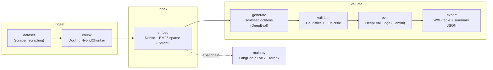

# Hybrid-RAG

> A DVC-orchestrated hybrid retrieval pipeline — dense + sparse embeddings, cross-encoder reranking, and LLM-as-a-judge evaluation — for grounded Wikipedia question answering.

[](#)
[](#)
[](https://www.python.org/downloads/)
[](#license)
[](#)
[](#)

---

## Overview

`Hybrid-RAG` is an end-to-end Retrieval-Augmented Generation system that answers questions about domain documents using a self-hosted, local large language model (LLM). It was built to demonstrate the full lifecycle of a production-grade RAG stack — from unstructured web ingestion and structural chunking, through a hybrid vector index, to a citation-backed, user-facing chat interface and an automated eval-and-report loop.

### The problem

Naïve RAG systems collapse under three well-known failure modes: (1) **poor retrieval** because they rely on a single embedding strategy, (2) **weak reranking** because the top-`k` candidates are scored only by a coarse embedding distance, and (3) **unmeasured reliability** because answers are shipped without a quantitative grounding signal. Each of these erodes answer accuracy and makes it impossible to know when a change to the pipeline is actually an improvement.

### The engineering approach

This repo addresses each failure mode deliberately. It layers **dense** (`BAAI/bge-base-en-v1.5`) and **sparse** (`Qdrant/bm25`) retrieval (a "hybrid" signal) into a single Qdrant collection, then re-scores the candidate set with a **cross-encoder** (`cross-encoder/ms-marco-MiniLM-L-6-v2`) before answer generation. Generation is done with a local Ollama model under **strict citation constraints** (every factual claim must be tagged `[Doc n]`), and the whole pipeline is wrapped in a **structured evaluation suite** that uses Gemini as an automated judge. Every stage runs as a param-driven **DVC** DAG node, so experiments are reproducible and a single `dvc repro` invalidates and re-runs only the stages that a parameter change actually touches.

**The bottom line:** this is a reference architecture for a reproducible, eval-driven RAG platform — not a throwaway demo — with type-safe config, structured logging, data versioning, and experiment tracking baked in from the ground up.

---

## Key features

- **Hybrid (dense + sparse) retrieval.** A single [Qdrant](https://qdrant.tech) collection stores both a 768-dim dense embedding per chunk and a BM25-style sparse vector, queried together in `HYBRID` retrieval mode for robust vocabulary + semantic coverage.
- **Cross-encoder reranking.** Top-`k` candidates (`retrieval_k`) are re-scored as `(query, doc)` pairs by `ms-marco-MiniLM-L-6-v2`, then filtered above `rerank_score_threshold` and truncated to the final `top_n`.
- **Structural document chunking.** Scraping (via `scrapling`) extracts clean, noise-filtered Wikipedia HTML, and Docling's `HybridChunker` produces chunks bounded to the embedding tokenizer, preserving source URL, topic, headings, and chunk id.
- **Self-hosted generation with enforced citations.** Answers come from a local Ollama model (`gemma4:31b`) through a LangChain chain that mandates inline `[Doc n]` citations, with graceful fallback when reranking filters everything out.
- **Synthetic golden-set generation + dual-layer validation.** DeepEval generates up-to-100 Q&A pairs from seeded chunks using a local synthesizer (`qwen3.8:27b`) with evolution strategies; a two-tier validator (deterministic heuristics + LLM-as-a-judge) drops hallucinated / unanswerable samples before eval.
- **Automated, judge-powered evaluation.** DeepEval runs Contextual Relevancy, Recall, Precision, Answer Correctness, and Citation Accuracy against a `gemini-3.5-flash-lite` judge, with a capped concurrency budget to keep the API stable.
- **DVC experiment lifecycle.** `dvc.yaml` declares a 6-stage DAG (`dataset → chunk → embed → generate → validate → eval → export`) with per-stage `params` and `outs`; `dvc.exp` records param/data versioning side by side with W&B metric logging.
- **Typed configuration layer.** `src.data.config.Config` is a Pydantic schema over `params.yaml` (`extra: forbid`, coercion + validation on load), so a bad value fails fast with a `ValidationError` instead of a `KeyError` inside a LangChain call.
- **Production-grade observability.** Stage-scoped structured logs (`logs/<stage>.jsonl`, one event per line) plus [Weave](https://weave.jina.ai) tracing of every retrieval/answer op.

---

## Tech stack

**Languages**

- Python 3.12 (see `.python-version`)

**Core frameworks / libraries**

- **[LangChain](https://python.langchain.com) (`langchain-core`)** — retrieval chain, rerank chain, and generation chain composition
- **[LangChain-HuggingFace](https://python.langchain.com)** — `HuggingFaceEmbeddings` + `CrossEncoder`
- **[LangChain-Ollama](https://python.langchain.com)** — local chat model integration
- **[LangChain-Qdrant](https://docs.qdrant.tech)** — dense/sparse vector store, `HYBRID` retrieval
- **[Docling](https://docling.io)** — document conversion and structured hybrid chunking
- **[DeepEval](https://docs.confident-ai.com)** — golden-set generation + LLM-as-a-judge evaluation
- **[FastEmbed](https://qdrant.github.io/fastembed/)** — sparse (`bm25`) embedding
- **[sentence-transformers](https://www.sbert.net)** — cross-encoder model
- **[scrapling](https://scrapling.net)** — stealthy (headless) Wikipedia fetcher
- **[Pydantic](https://docs.pydantic.dev)** — config + data-model validation
- **[Rich](https://rich.readthedocs.io)** — terminal UI / progress / structured logging

**Infrastructure & tooling**

- **[DVC](https://dvc.org)** — DAG orchestration, data versioning, experiment management
- **[Weights & Biases (wandb)](https://wandb.ai) + [Weave](https://weave.jina.ai)** — experiment tracking, metric logging, tracing
- **[uv](https://github.com/astral-sh/uv)** — dependency management & virtual environment
- **[qdrant-client](https://qdrant.tech)** — local file-based vector store

**LLMs**

| Role | Model | Where |
|---|---|---|
| Chat / answer generation | `gemma4:31b` | Ollama (local) |
| Golden-set synthesizer | `qwen3.8:27b` | Ollama (local) |
| Golden-set validator | `gemma4:31b` | Ollama (local) |
| LLM-as-a-judge (eval) | `gemini-3.5-flash-lite` | Google GenAI |
| Dense embeddings | `BAAI/bge-base-en-v1.5` | HuggingFace |
| Sparse embeddings | `Qdrant/bm25` | FastEmbed |
| Cross-encoder reranker | `cross-encoder/ms-marco-MiniLM-L-6-v2` | sentence-transformers |

---

## System architecture & how it works

### Pipeline DAG

The pipeline is a directed acyclic graph defined in [`dvc.yaml`](dvc.yaml). Each stage reads typed config from `params.yaml`, declares declared inputs (`deps`) and outputs (`outs`), and is tracked in `dvc.lock`. Changing a param only re-runs the stages that actually depend on it.



### Data flow

1. **Scrape (`dataset`):** `src/create_dataset.py` fetches each Wikipedia URL with `scrapling` and strips Wikipedia noise (scripts, nav boxes, references, TOC, appendices) with BeautifulSoup, producing `data/raw/ai_ml_raw_html.json` of `{metadata, raw_html}` records.
2. **Chunk (`chunk`):** `src/create_chunks.py` feeds each record through Docling and applies `HybridChunker` (bounded to the embedding tokenizer, with a minimum-word-count filter), producing `data/processed/ai_ml_rag_chunks.json`.
3. **Embed & index (`embed`):** `src/create_embeddings.py` builds the Qdrant collection with two vector configs (dense 768-dim, sparse `bm25`) and persists `data/embeddings_status.json` as the DVC anchor for the store.
4. **Generate goldens (`generate`):** `src/generate_baseline.py` seeds isolated contexts from the index, runs DeepEval's synthesizer with evolution strategies, and logs quality distributions to W&B.
5. **Validate (`validate_goldens`):** `src/validate_goldens.py` applies deterministic heuristics and a two-point LLM critic (`is_answerable` + `is_faithful`) against `data/eval/goldens_clean.json`.
6. **Evaluate (`eval`):** `src/run_evals.py` runs the five DeepEval metrics with cache-based early exit and capped async concurrency.
7. **Export (`export`):** `src/export_results.py` aggregates per-metric scores, builds a W&B table, and writes the final `evaluation_results` JSON.

### Runtime retrieval chain

At query time (`main.py`), the pipeline composes two LangChain sub-chains: a **retrieval chain** (`RetrievalMode.HYBRID` → cross-encoder rerank) and a **generation chain** (format docs → chat prompt → Ollama). Reranked documents are injected as richly structured context blocks carrying source/topic/headings, and the prompt enforces inline `[Doc n]` citations.

---

## The math behind hybrid retrieval

The retrieval quality of a RAG stack hinges on how the candidate set is ranked. Hybrid-RAG uses three scoring stages, each with an explicit objective.

### 1. Dense retrieval — cosine similarity

For a query `q` and chunk `d`, the dense component measures directional agreement between their embedding vectors:

```
sim_dense(q, d) = <E_dense(q), E_dense(d)> / (||E_dense(q)|| · ||E_dense(d||)
```

where `E_dense(·)` is `BAAI/bge-base-en-v1.5`. Candidates are collected greedily (`retrieval_k`) from the dense partition.

### 2. Sparse retrieval — BM25

For the same query and chunk, BM25 aggregates per-term contributions keyed on term frequency (`tf`), IDF-weighting, and length normalization:

```
scoresparse(q, d) = Σ_{t ∈ q} IDF(t) · ( f(t, d) (k3 + 1) ) / ( f(t, d) + k3 · (1 + b (1 − b) ) )
```

where `f(t, d)` is the term frequency of `t` in `d`, `IDF(t)` is the inverse document frequency, and `k3`, `b` are the FastEmbed defaults. This is what recovers exact-name / out-of-distribution vocabulary the dense model under-weights.

### 3. Reranking — cross-encoder score

Before answer generation, the top-`k` candidates are re-scored in one shot as `(query, doc)` pairs and filtered by a learned margin `τ` (`rerank_score_threshold`):

```
keep(doc_i) = 1  if  σ_ms-marco(q, d_i) > τ
            = 0              otherwise
```

The surviving set (truncated to `top_n`) drives generation, with a guaranteed-fallback to the single best-scoring doc if `τ` filters everything out — so the chat always returns an answer.

---

## Installation & setup

### Prerequisites

1. **Python 3.12** (pinned via `.python-version`) and [`uv`](https://astral.sh/uv/getting-started/installation) for dependency management.
2. **[DVC](https://dvc.org/doc)** (`dvc` ≥ 3.67.1 — also a venv dependency) for pipeline orchestration and data versioning.
3. **[Ollama](https://ollama.com/** running locally** with the models named in [`params.yaml`](params.yaml) pulled in ahead of time:**

   ```bash
   ollama pull gemma4:31b
   ollama pull qwen3.8:27b
   ```

4. **A GPU with CUDA** — dense embeddings hardcode `device: cuda`.
5. **API keys** in a `.env` file (see below): `HF_TOKEN` (HuggingFace, for embedding models) and `GOOGLE_API_KEY` (Google GenAI, for the DeepEval judge).

### Create a virtual environment with `uv`

```bash
uv venv
uv pip install -e .
```

### Configure your environment

`.env` is gitignored. Create it before running anything:

```bash
touch .env   # then add the variables below
# inside .env:
HF_TOKEN=your_huggingface_token
GOOGLE_API_KEY=your_gemini_api_key
WANDB_API_KEY=your_wandb_api_key      # optional — only if you log to W&B
```

### Prepare the target data

Point `urls_path` (in [`params.yaml`](params.yaml)) at a newline-delimited list of documents and store it at that path:

```
data/urls/database_urls.txt
```

---

## Usage & quick start

### Run the full pipeline

`dvc repro` runs **only stale stages** (DVC decides based on `deps`, `params`, `outs`). To avoid the expensive scrape/GPU/judge stages mid-development, **target a single stage explicitly**:

```bash
dvc repro                 # run only stale stages, in topological order
dvc repro chunk           # run just the chunk stage
dvc exp run -S top_n=7 -S chunk_max_tokens=400   # run with param overrides
dvc exp show              # side-by-side comparison of runs
```

`dvc repro` will run **all stages** — never run it bare mid-development.

### Pipeline stages

Each stage is also runnable standalone (from the repo root, using the `venv/bin/python` path so `python` isn't required on `PATH`):

```bash
.venv/bin/python src/create_dataset.py       # scrape → data/raw/ai_ml_raw_html.json
.venv/bin/python src/create_chunks.py        # chunk → data/processed/ai_ml_rag_chunks.json
.venv/bin/python src/create_embeddings.py    # index → Qdrant collection
.venv/bin/python src/validate_goldens.py     # validate goldens
.venv/bin/python src/run_evals.py --input data/eval/goldens_clean.json --output data/eval/raw_evaluations.json --cache data/eval/cache.json
.venv/bin/python src/export_results.py --input data/eval/raw_evaluations.json --output data/eval/evaluation_results.json --run_name eval_synthetic_baseline
```

### Interactive chat

```bash
python main.py
```

Expected output:

```
======================================
🤖 Hybrid-RAG Wikipedia Assistant Initialized
======================================
Type 'exit' or 'quit' to stop.

Query: What is the difference between supervised and unsupervised learning?
Retrieving & Generating...

Answer:
In machine learning, supervised learning trains models on **labeled data**
where each example has a known target, while unsupervised learning trains
on **unlabeled data**, discovering patterns on its own. [Doc 1]
```

### Tunable parameters

Every lever lives in [`params.yaml`](params.yaml). The main knobs and what they touch:

| Parameter | Effect on the pipeline |
|---|---|
| `chunk_max_tokens` / `chunk_merge_peers` | Chunk size → everything downstream (chunk, embed, eval). |
| `retrieval_k` | Size of the candidate pool before reranking. |
| `rerank_score_threshold` | Stricter filter for the reranker (defaults `-2.5`, a near-no-op). |
| `top_n` | Final number of docs injected into generation. |
| `chat_model` / `chat_temperature` | Generation model and randomness. |
| `synthesizer_*` / `quality_*` / `num_evolutions` | Golden-set quality and evolution. |
| `wandb_project` / `wandb_group` | Where runs are logged and how they cluster in the W&B UI. |

### Results & parameter tuning

A full sweep of the retriever parameters (DVC-experimented, metric-logged to W&B `rag-optimization`, model `nirmal_yadagani`) quantifies exactly what moved the needle. Synthetic goldens = 67 cases; manual hard questions = 10.

| Retriever config | Contextual Relevancy | Contextual Recall | Contextual Precision | Answer Correctness | Citation Accuracy |
|---|---|---|---|---|---|
| **Baseline (chunk=350)** | **0.585** | 0.942 | 0.915 | 0.943 | 0.916 |
| **chunk=250 (best config)** | **0.745** | 0.942 | 0.958 | 0.975 | 0.950 |

The single biggest win was cutting chunks from 350 → 250 — **Contextual Relevancy jumped +27% (0.585 → 0.745)**. A tighter chunk shrinks each retrievable document to one topic, which directly raises the judge's relevance score. Reranking (`rerank_score_threshold: 0.5`) added another +12% over the baseline and lifted Answer Correctness, with a small trade-off on Contextual Recall. `top_n` (3→7) turned out to be a no-op. The `rerank_score_threshold` sweep revealed a real tension: synthetic quality peaks at a tighter threshold while the harder manual questions need a looser one — the answer is a middle-ground value that both stay above 0.5.

---

## Roadmap & future work

1. **Multi-document retrieval & hybrid multi-query expansion.** Add a LangChain `MultiQueryRetriever` / `Self-Ask` generator so complex questions are rephrased into multiple queries, then merged — scaling the system beyond single-shot retrieval.
2. **Retrieval & answer improvement loop (RAGAs / faithfulness).** Extend the DeepEval suite with `Faithfulness` and `AnswerRelevancy` metrics plus a retrieval-augmented evaluation harness, closing the loop between measured accuracy and pipeline tuning.
3. **Distributed serving & multi-modal ingestion.** Migrate Qdrant to a remote cluster behind the Qdrant HTTP API, add a `docs`-style ingestion path (PDFs, markdown) for enterprise documents, and expose the chain behind an HTTP API for external consumers.

---

## License

This project is provided as-is for demonstration purposes.

## Acknowledgments

Built to demonstrate a reproducible, eval-driven RAG architecture: **LangChain**, **Qdrant**, **Docling**, **DeepEval**, **DVC**, **Weights & Biases**, and **Weave**.
